# 

# 🎉 PAJAMA

## ✨ 팀 소개

- 김준우 : 팀장, 백엔드, WebRTC 구현, 서버 담당
- 김경호 : 백엔드, 모션인식, 음성인식 담당
- 김유완 : 백엔드, Entity 설계 및 API 구현, Jira관리자
- 이동주 : 프론트엔드
- 정재철 : 프론트엔드
- 진주현 : 프론트엔드

## 💡기획배경

파자마 서비스 기획 배경은 코로나 장기화로부터 시작되었습니다.

코로나 직 후에는 비대면 생활이 매우 생소하였지만 현재는 코로나 장기화로 온라인 화상 회의, 강의등이 활성화 되었으며 이런 비대면 서비스가 익숙해졌고 다양하게 사용되고 있습니다.

그 중 저흰 파티라는 테마를 선택하여 날씨,공간의 제약 없이 언제든지 파티를 할 수 있는 서비스를 기획하게 되었습니다.

## ⭐프로젝트 핵심 기능

### WebRTC

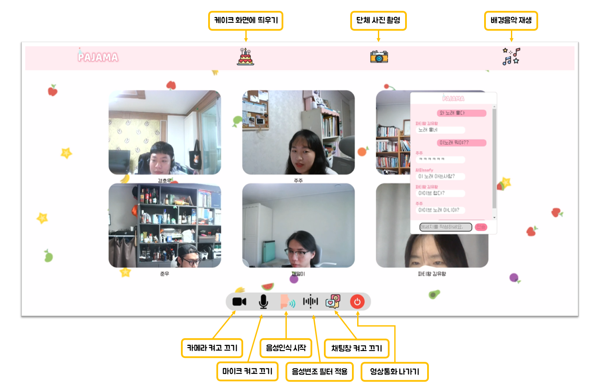

### 모션인식

- 모션 인식을 통한 폭죽 효과

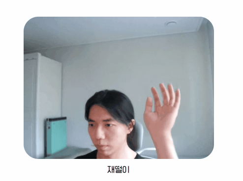

- 모션 인식을 통한 촛불 끄기


- 모션 인식 ( 하트 )


- 모션 인식 ( 브이 )


- 모션 인식 ( 일 모양 )

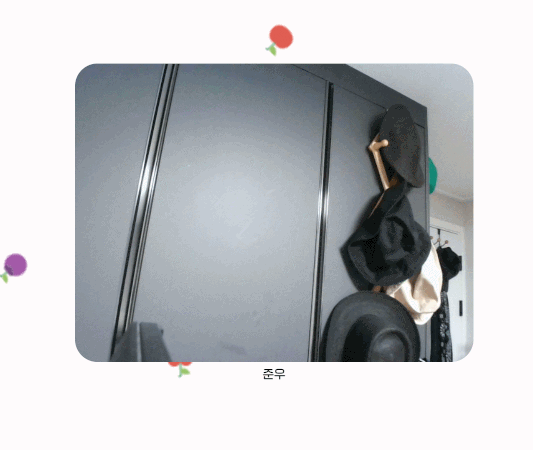

### 음성인식(Speech-to-Text)

- 음성 인식을 통해 음악 재생

## 👌 프로젝트 상세 설명

## ERD

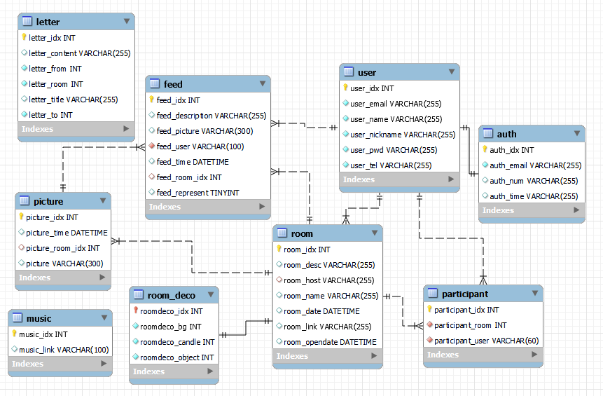

## ⌨️ 기술스택

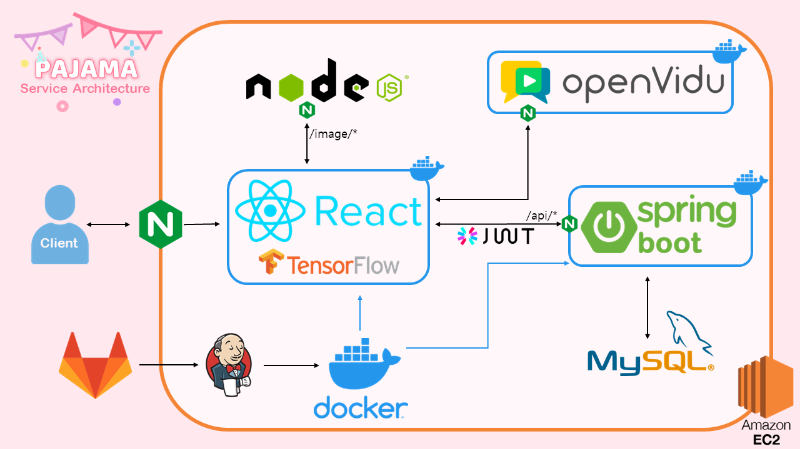

### Server-side

- Spring Boot 2.7.1 + JPA + Gradle
- AWS
- KMS (Kurento Media Server)
- Docker
- Jenkins
- Nginx
- Node.js (express.js)
- JWT Authentication
- My SQL 8.0.30

### Client-side

- React.js 18.2.0
- Redux 4.2.0
- Node.js 16.16.0
- React Bootstrap
- Openvidu

### 주요 API

- Tensorflow.js
- Web Speech Api
- WebSocket
- REST API

### 협업툴

- Gitlab
- Jira
- Notion
- Mattermost
- Webex
- Figma
- Draw.io

## 🔨 Git 컨벤션

```bash
# FEAT : 새로운 기능 추가
# FIX : 버그 수정
# DOCS : 문서 수정
# DATA : DataSet, 단순 데이터 관련 사항
# DB : 데이터베이스 관련 사항
# TEST : 테스트 코드 추가
# REFACTOR : 코드 리팩토링
# STYLE : 코드 의미에 영향을 주지 않는 변경사항
# CHORE : 빌드 부분 혹은 패키지 매니저 수정사항
# DIR : 디렉토리 관련 변경사항 (추가/삭제/수정)
# DEL : 삭제
# ETC : 기타
# Ex) [FEAT][A-01] : 회원가입 구현
################
# ! : 필요
# Ex) !FIX : 버그 수정 필요, !FEAT : 기능 추가 필요, !DOCS : 문서화, 문서 수정 필요
# HOT : 급한 작업(우선 순위 작업)
# Ex) !HOTFIX : 긴급 버그 수정 필요
# * : 두 가지 이상의 태그가 필요할 때 (권장하지 않음 - 되도록 따로따로 커밋 부탁드립니다.)
# Ex) [FEAT] * [DIR] : 회원가입 구현, 디렉토리 변경 XXX.Java
```

## 배포

[바로가기](https://lab.ssafy.com/s07-webmobile1-sub1/S07P11C203/-/blob/master/exec/README.md)

## 💻서비스 화면

### 메인 페이지

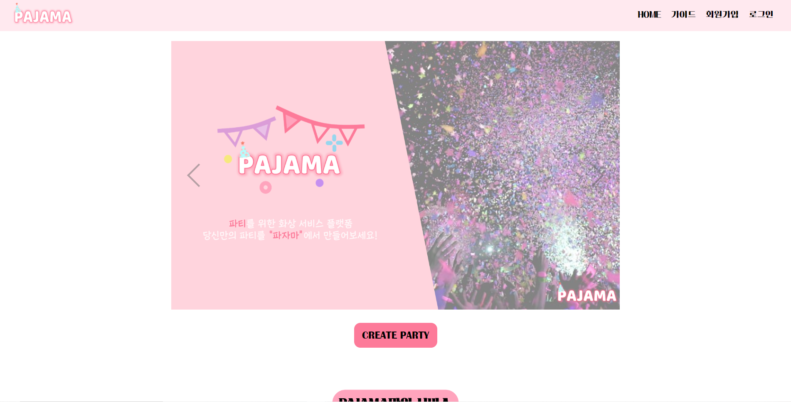

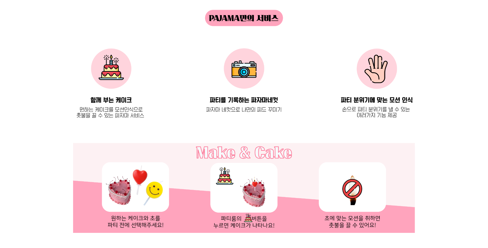

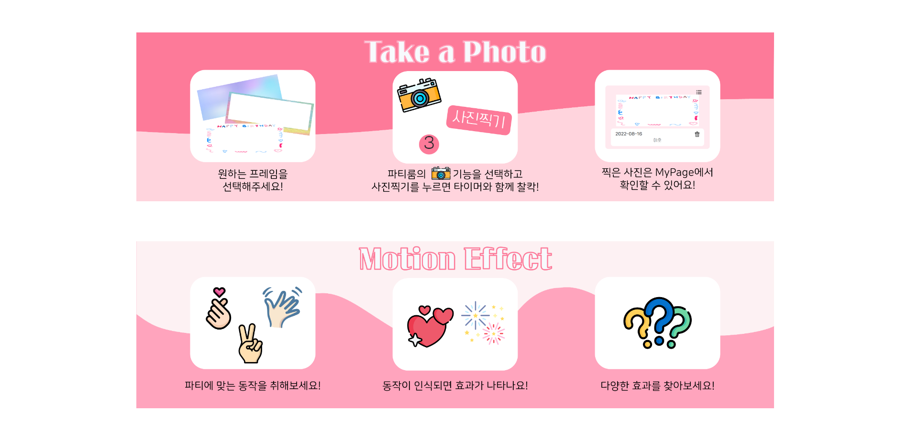

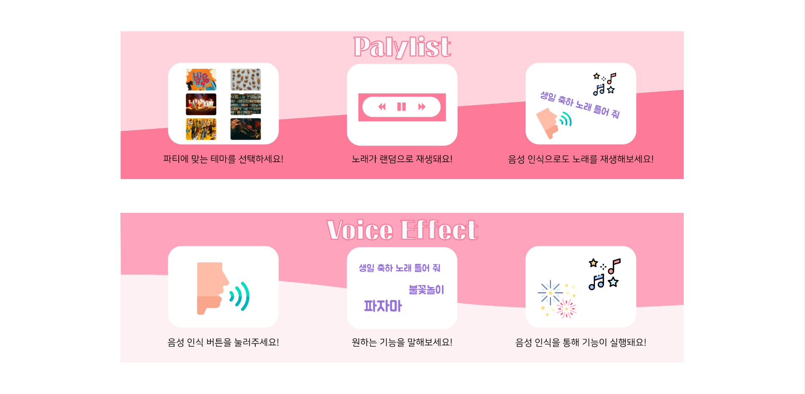

### 회원가입 및 로그인

- 회원가입 ( 본인 인증을 위해 이메일 인증번호 전송 )

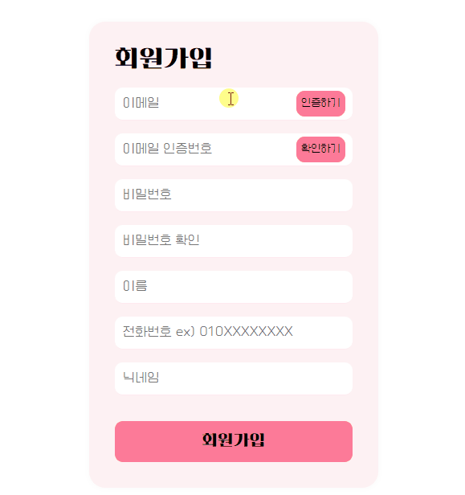

- 로그인 , 비밀번호 초기화 ( 이메일을

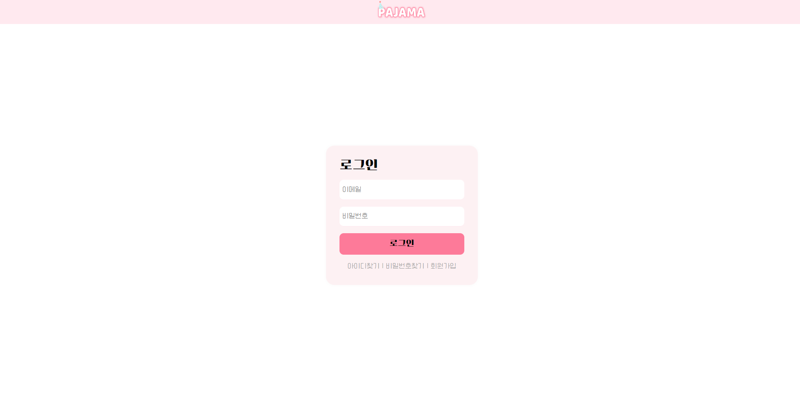

- 아이디 찾기 ( 전화번호를 통해 아이디의 일부를 보여줌 )

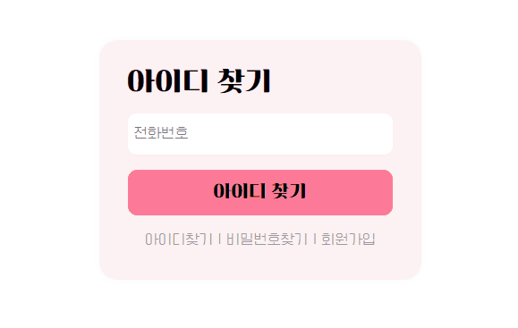

- 비밀번호 찾기 ( 이메일을 통해 새로운 비밀번호를 제공함 )

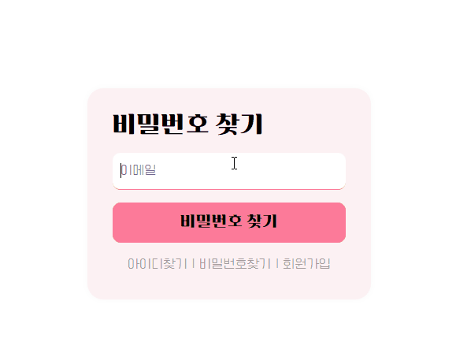

### 파티룸 생성

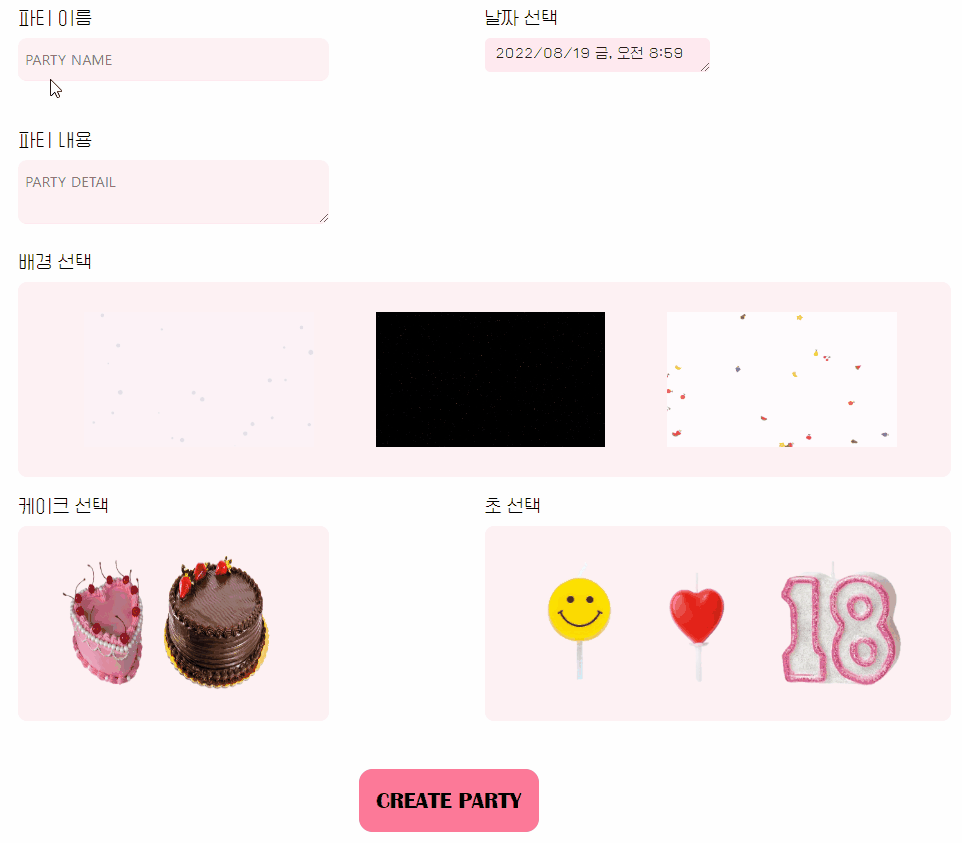

### 화상 미팅룸 및 그룹 채팅

- 채팅 화면

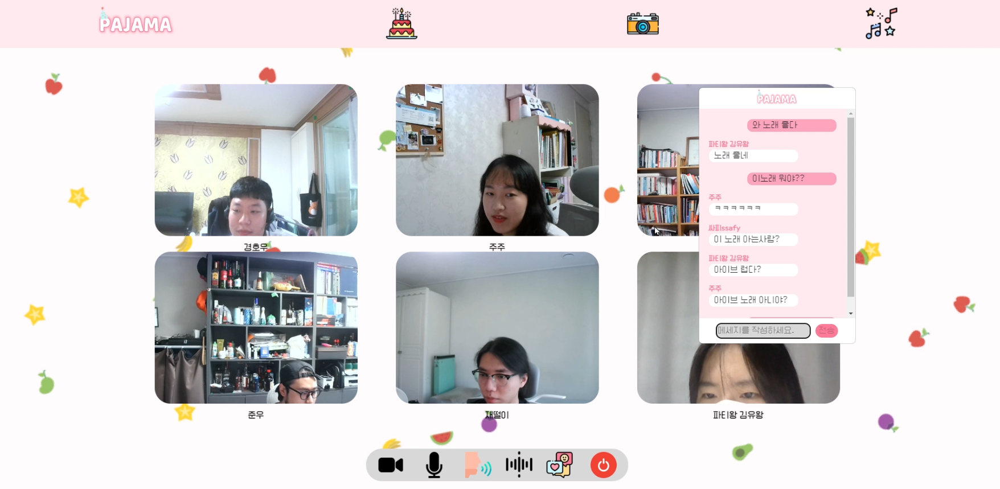

### 음악재생

### 사진촬영

### 마이페이지

- 참여한 파티 별로 찍었던 사진을 확인할 수 있음

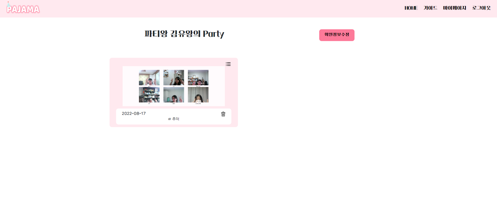

- 여러 사진과 피드 내용 수정, 피드 삭제 가능

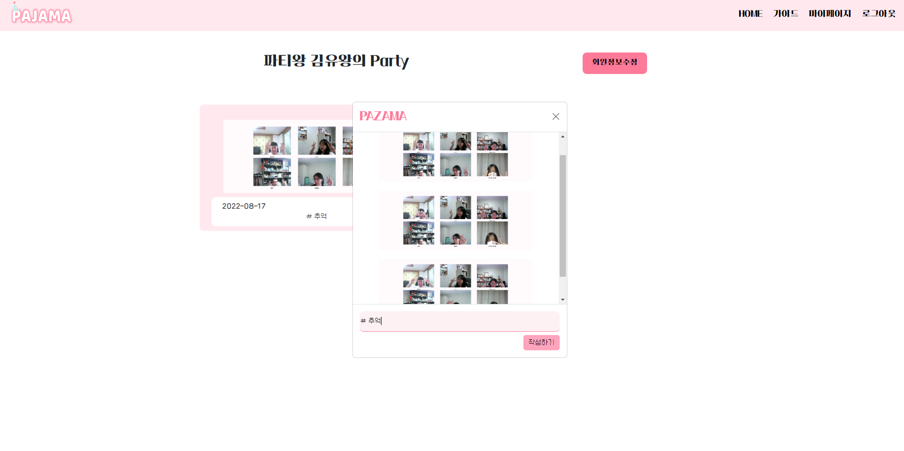
